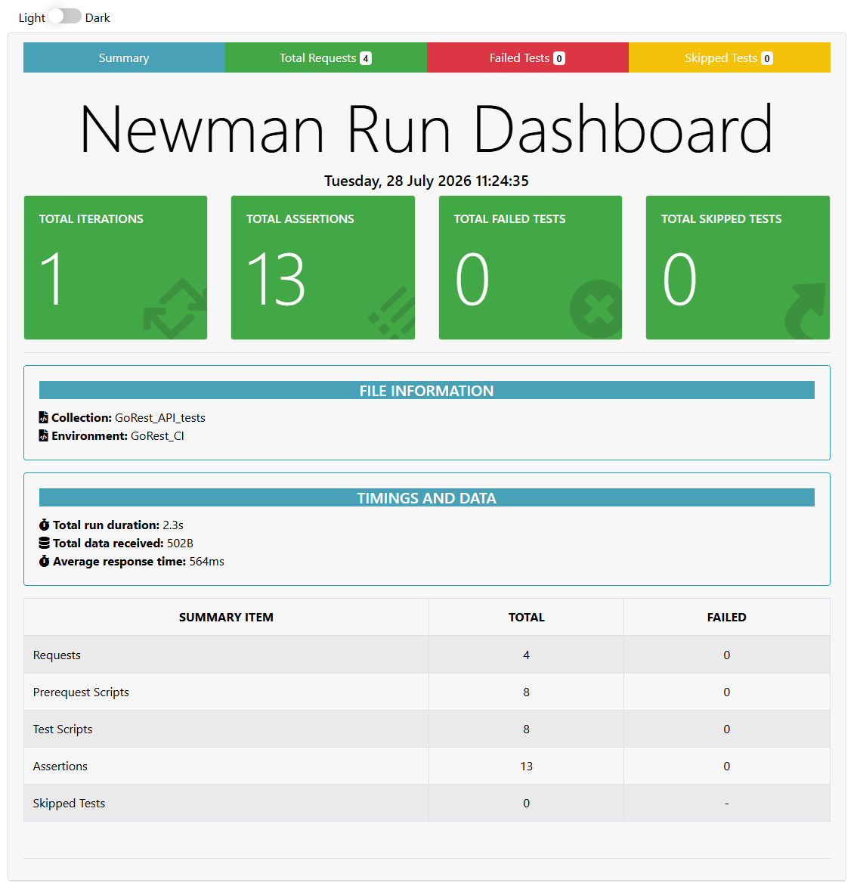

# api-postman
[](https://github.com/jkwiecinska-work/api-postman/actions/workflows/api-tests.yml)

Internal project for REST API automated tests in Postman, using [GoRest](https://gorest.co.in) API

## Skills showcase
- API tests automation
- CI/CD integration with GitHub Actions
- Authorization with bearer token
- Postman/Newman usage in API testing
- Secret and variables management
- Environment management
- Clear & professional project documentation (Markdown)

## Run locally from CLI
```bash
npm install -g newman
newman run postman/postman/GoRest_API_tests.postman_collection.json -e postman/postman/GoRest_CI.postman_environment.json
```
## Key Design & Technical Features

- **Dynamic Data Generation**: Pre-request scripts generate randomized emails and timestamps to prevent data collision.
- **Context & Test Chaining**: Response values (e.g. `user_id`) are stored in environment variables and passed sequentially between requests.
- **Secure Secrets Handling**: Sensitive tokens (`ACCESS_TOKEN`) are decoupled from code and injected via GitHub Secrets.
- **SLA & Performance Assertions**: Every endpoint validates response times under 2000ms threshold.

## Test Report
Test execution results are automatically compiled into an interactive HTML report generated by `newman-reporter-htmlextra`.


The report provides:
- Executive summary of passed/failed assertions and execution time.
- Detailed breakdown per endpoint (`POST`, `GET`, `PATCH`).
- Artifact availability in GitHub Actions workflows.

### Download test report
Test report can be retrieved by opening: Tab Actions -> Workflow Run -> Section Artifacts - section includes zip file with test report. 
